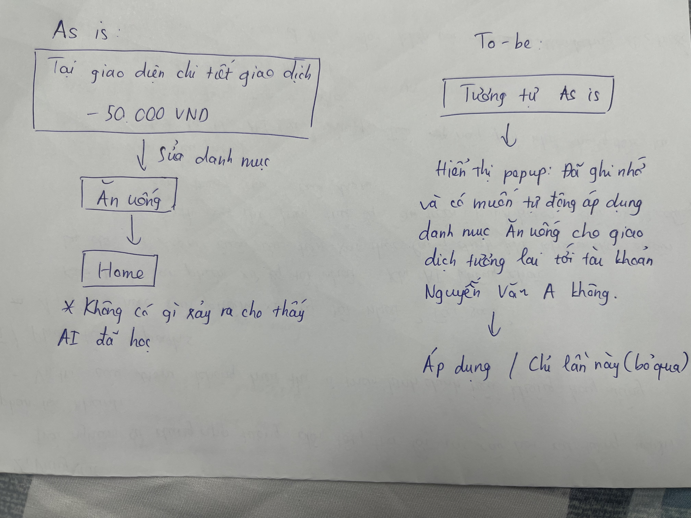

# UX exercise — MoMo Moni AI

## Sản phẩm: MoMo — Trợ thủ cá nhân Moni

## Phân tích 4 paths

### 1. Khi AI đúng
- **Tình huống:** Người dùng thanh toán hóa đơn tiền điện (EVN) hoặc tiền nước định kỳ hàng tháng trên app.
- **Trải nghiệm:** Moni nhận diện chính xác nguồn tiền ra và tự động gắn tag "Hóa đơn & Tiện ích". 
- **UI/UX:** Giao dịch hiển thị ngay icon bóng đèn/giọt nước rất trực quan, không yêu cầu người dùng xác nhận. Dòng chảy (flow) kết thúc êm đẹp.

### 2. Khi AI không chắc
- **Tình huống:** Người dùng quét mã VietQR cá nhân của một cô bán trà đá hoặc xe bánh mì ven đường. Nội dung chuyển khoản thường để trống hoặc ghi chung chung.
- **Hệ thống xử lý:** Hệ thống phân vân không biết đây là khoản "Ăn uống" hay "Cho vay/Chuyển tiền cá nhân". Thay vì hỏi, AI chọn cách an toàn là xếp vào nhóm "Khác" hoặc "Chuyển tiền".
- **Vấn đề thiết kế:** Chỗ này Moni đã bỏ lỡ một "learning signal". Đáng lẽ hệ thống nên hiển thị một thông báo nhẹ (soft prompt): "Có vẻ bạn vừa thanh toán dịch vụ, đây có phải khoản chi Ăn uống không?".

### 3. Khi AI sai
- **Tình huống:** Người dùng thanh toán tiền ăn tại nhà hàng, nhưng nhà hàng lại dùng mã QR tĩnh của một cổng thanh toán trung gian (như VNPAY, Payos). Moni phân tích dữ liệu đối tác và gắn nhầm tag thành "Dịch vụ tài chính" hoặc "Thanh toán hóa đơn".
- **Hành trình sửa sai:** Người dùng chỉ phát hiện ra khi cuối tháng thấy khoản "Dịch vụ tài chính" phình to bất thường. Để sửa, họ phải lội lại lịch sử giao dịch, bấm vào chi tiết, chọn lại danh mục "Ăn uống". 
- **Vấn đề:** Không có cơ chế thông báo cho người dùng biết rằng hệ thống đã ghi nhận việc sửa đổi này để lần sau gặp cổng VNPAY của nhà hàng đó sẽ tự động tag đúng.

### 4. Khi user mất niềm tin
- **Tình huống:** Người dùng thường xuyên chuyển một khoản tiền cố định cho người thân để lo sinh hoạt phí chung. Moni liên tục ghi nhận toàn bộ số tiền này là "Chi tiêu cá nhân" của người dùng, làm biểu đồ tài chính cá nhân bị sai lệch hoàn toàn.
- **Hệ thống xử lý:** Sau nhiều lần sửa thủ công bất lực, người dùng không thể tạo được một "rule" (quy tắc) như: "Bỏ qua các giao dịch đến số tài khoản này khỏi báo cáo chi tiêu".
- **Hậu quả:** Không có "lối thoát" (exit) để tùy chỉnh sâu hoặc tắt tính năng theo đối tượng, người dùng cảm thấy báo cáo của Moni là vô dụng và không mở tính năng thống kê lên xem nữa.

## Path yếu nhất: Path 4
- **Nhận xét:** Việc thiếu khả năng thiết lập quy tắc cá nhân hóa (Personalized Rules) kết hợp với AI khiến người dùng rơi vào ngõ cụt khi AI liên tục đoán sai ở những tình huống chuyển tiền nội bộ/người thân. Khi niềm tin vỡ lở, sản phẩm không cung cấp công cụ (fallback) nào để người dùng lấy lại quyền kiểm soát ngoài việc sửa tay từng giao dịch.

## Gap marketing vs thực tế
- **Kỳ vọng:** Marketing định vị Moni là "Trợ lý hiểu thấu thói quen chi tiêu", ám chỉ khả năng tự học hỏi cao.
- **Thực tế:** Sản phẩm hoạt động giống một hệ thống rule-based (dựa trên danh mục đối tác định sẵn) hơn là một AI thực thụ. AI không hiểu được ngữ cảnh chuyển tiền cá nhân và thiếu vòng lặp phản hồi (feedback loop) rõ ràng khi người dùng nỗ lực sửa sai. Khoảng trống nằm ở việc hứa hẹn sự thấu hiểu, nhưng lại cung cấp một trải nghiệm cứng nhắc.

## Sketch

